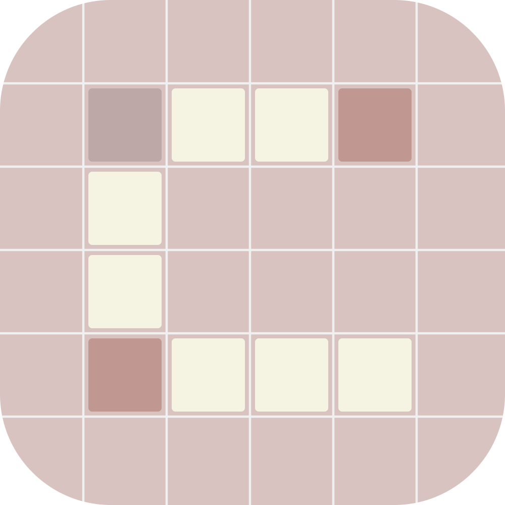

<p align="center">
  
</p>

<h1 align="center">Curium</h1>

<p align="center">
  Modern, privacy-first QR code generator, customizer, and scanner.<br/>
  No analytics. No network. Just your codes.
</p>

<p align="center">
  
  
  
  
  
</p>

---

### Why Curium Exists

QR code is a 35-year-old public domain standard. The idea that companies can charge you for generating a QR code — or worse, track you while doing it, is absurd.

The QR code industry has become something completely different from what its inventors intended. Most online QR code generators work the same way: they let you create a code, then track you, log your data, force you to create an account or serve you ads. They’re “free” because you are the product. Capitalism has managed to ruin even the most basic digital tools. Every feature must be behind a paywall. Every interaction must be tracked and monetized.

Curium rejects this. Some things should just work. Some things should be free. Some things should respect your privacy by default — not as a premium feature.
Unlike the others, Curium offers a modern, clean UI/UX with no ads, no bloat, no spyware, and no hunger for your data. As it develops, it continues to ship every feature an ideal QR tool should have.

With official releases for Android, Windows, macOS, Linux, CLI, Web, and eventually iOS, Curium aims to deprecate and make every other QR tool obsolete — bringing an end to decades of QR capitalism.

---
<p align="center">
<a href="https://github.com/nylxar/curium/releases"><picture><source media="(prefers-color-scheme: dark)" srcset="https://shieldcn.dev/github/nylxar/curium/release.svg?logo=lu%3ADownload&amp;label=download&amp;mode=dark"></picture></a>
</p>

> **Preview builds** may feel rough or unpolished and may contain bugs. They are intended for early testing and feedback.

---
### Status


---

### Screenshots

<table>
  <tr>
    <td></td>
    <td></td>
    <td></td>
    <td></td>
  </tr>
  <tr>
    <td></td>
    <td></td>
    <td></td>
    <td></td>
  </tr>
</table>

---

## Features

### QR Generator
- **10 payload types** : URL, text, Wi-Fi, email, phone, SMS, contact, location, event, OTP auth
- **21 pixel styles** : sharp, soft, round, dots, liquid, glued, smooth, flow, blob, diamond, cross, star, triangle, hexagon, plus, heart, sparkle, pinched-square, circuit-board, hashtag, vertical-line, horizontal-line
- **8 eye styles** : sharp, soft, round, pill, dot, shield, hexagon, octagon
- **18 pupil styles** : dot, square, diamond, cross, hexagon, octagon, shield, star, heart, blob, dome, oval, pentagon, scallop, cloud, droplet, and more
- **Logo overlay** : pick from gallery, resize, reposition by drag
- **Logo background** : rounded, circle, or none
- **Logo border & shadow** : toggle independently
- **Error correction** : L, M, Q, H; auto-bumped to H when a logo is applied
- **Randomize** : shuffle all colors and styles instantly
- **Live preview** : updates as you edit

### QR Scanner
- **Camera scan** : QR codes + barcodes (EAN-13, Code 128, PDF417, Aztec, Data Matrix)
- **Gallery scan** : scan QR codes from images in your photo library
- **Torch toggle** : low-light scanning
- **Scan to customize** : scan any existing QR, load into generator, restyle and export
- **Smart open** : opens URLs, dials phones, composes emails, launches maps, and more

### Templates
- **Save styles** : save any QR configuration as a named template
- **One-tap load** : restore a saved template instantly
- **Delete** : remove unwanted templates

### Batch Generation
- **Multi-QR** : create dozens of QR codes in one session
- **Style shuffle** : assign random styles to each QR independently
- **CSV import/export** : bulk data management
- **Export as zip** : SVG or PNG, timestamped filenames

### Export
- **Save PNG** : high quality, saved to gallery
- **Share PNG** : send via any installed app
- **Share SVG** : vector format, shared as document
- **Copy content** : clipboard

### Themes
- **Light / Dark / System** : follows device preference
- **AMOLED** : pure black for OLED screens
- **Dynamic** : UI syncs to your QR's background color
- **Smooth transitions** : cross-fade between themes

### History
- **Auto-save** : every QR you create is stored locally
- **Detail view** : tap any saved QR to view, share, or delete
- **Swipe-to-delete** : remove individual entries
- **Clear all** : with confirmation dialog
- **Search** : filter by content or type

### Desktop (Tauri)
- **Tabbed sidebar** : Generate, Style, Adjust, Batch, Templates, History, Settings
- **Custom title bar** : native window controls
- **Keyboard shortcuts** : Space (shuffle), Ctrl+S (SVG), Ctrl+Shift+S (PNG)
- **Draggable logo** : position with mouse
- **Onboarding** : Welcome + What's New screens

---

## What's Coming

- [ ] CLI tool — headless QR generation for scripts and CI/CD
- [ ] Web app — browser-based generator
- [ ] iOS app — full feature parity with Android
- [ ] QR-from-image — upload an image, generate a QR that visually matches its color palette
- [ ] Animated QR — QR that transitions between two states
- [ ] Multi-color regions — different colors per data region
- [ ] QR version override — force specific module count
- [ ] Eye size slider (5–9 modules)
- [ ] Per-eye size control (each eye independently sized)
- [ ] Drag-to-reposition eyes within the grid
- [ ] Scan confidence indicator
- [ ] QR history tags / folders
 
---

## Tech Stack

| Layer | Mobile | Desktop |
|-------|--------|---------|
| Framework | Expo SDK 56, React Native 0.85 | Tauri (Rust and React) |
| Navigation | Expo Router | React Router |
| Animations | React Native Reanimated 4 | GSAP |
| Gestures | react-native-gesture-handler | Native events |
| Camera | react-native-vision-camera | — |
| Storage | AsyncStorage | localStorage / tauri-plugin-store |
| Bundler | Metro | rsbuild |
| Language | TypeScript | TypeScript |
| Typeface | IBM Plex Mono | IBM Plex Mono |

---

## Project Structure

```
app/                     Expo Router screens (mobile)
components/qr/           QR creation, styling, export, templates
components/ui/           Shared UI primitives (sheets, toasts, overlays)
constants/               Theme tokens, QR presets, build info, release notes
context/                 Theme provider
services/                Local history, settings, and template persistence
utils/                   SVG export, release notes parser
types/                   QR payload and style types
plugins/                 Expo config plugins
scripts/                 Build info generator, release notes sync
assets/                  Fonts, icons, splash assets
packages/
  shared/                Shared types, constants, utilities (mobile + desktop)
  desktop/               Tauri + React desktop app
    src/                 Desktop components, styles, utils
    src-tauri/           Rust backend, Tauri config, icons
```

---

## Getting Started

### Prerequisites

- Node.js 22+
- pnpm
- Android Studio or a connected device (mobile)
- Rust toolchain (desktop)

### Install

```bash
git clone https://github.com/nylxar/curium.git
cd curium
pnpm install
```

### Run Mobile

```bash
pnpm start
# or
pnpm android
```

### Run Desktop

```bash
cd packages/desktop
pnpm tauri dev
```

### Build Release

Releases are built automatically via GitHub Actions when a `v*` tag is pushed.

- **Android**: Creates draft release with APK/AAB splits
- **Desktop**: Builds DMG (macOS), NSIS (Windows), AppImage (Linux) and uploads to the same release

Or download the latest from [Releases](https://github.com/nylxar/curium/releases).

---

## CI/CD

| Workflow | Trigger | Platforms | Release |
|----------|---------|-----------|---------|
| Android APK Splits | Push tag `v*` | Android | Yes (draft) |
| Desktop Release | Push tag `v*` | macOS, Windows, Linux | Yes (uploads to Android release) |

---

## Permissions (Mobile)

| Permission | Why |
|-----------|-----|
| `CAMERA` | QR code scanning |
| `READ_MEDIA_IMAGES` | Gallery scan & logo picker |

No microphone. No location. No network access.

---

## License

[GNU General Public License v3.0](LICENSE)

---

<p align="center">
  Built with care. No telemetry. No accounts. Just codes.
</p>
